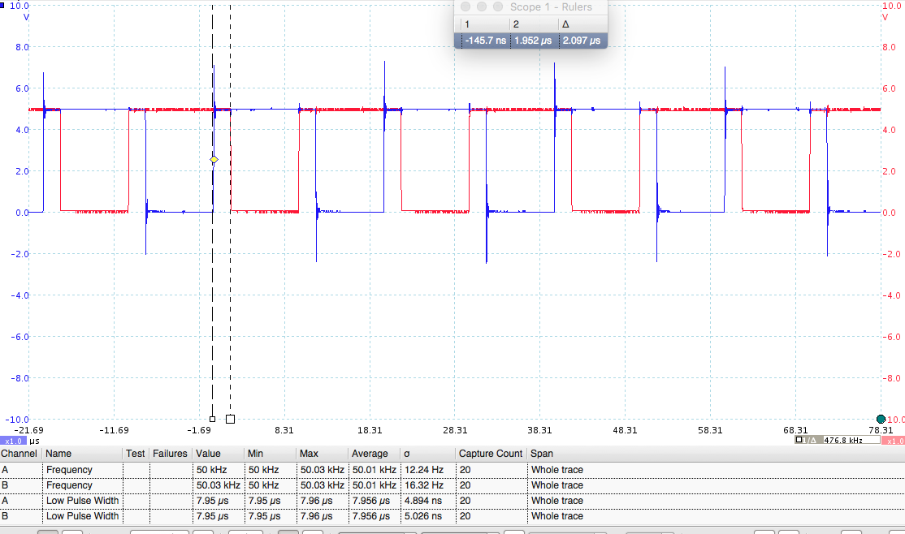
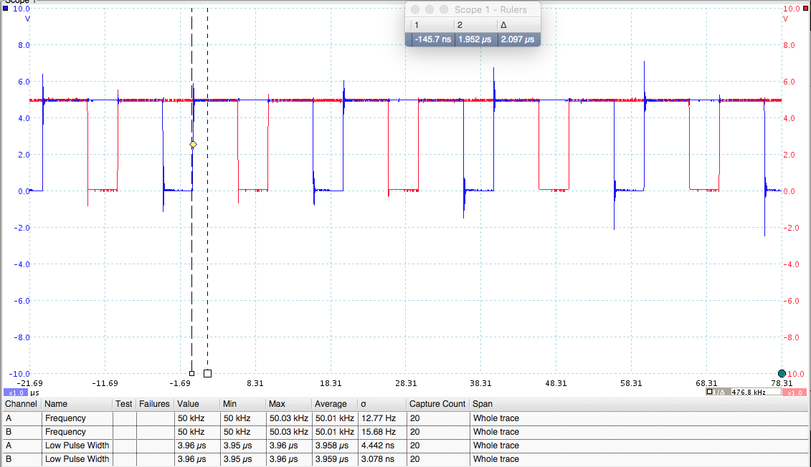
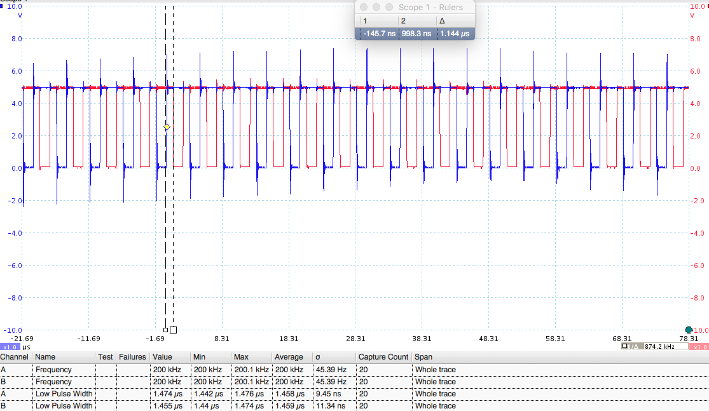
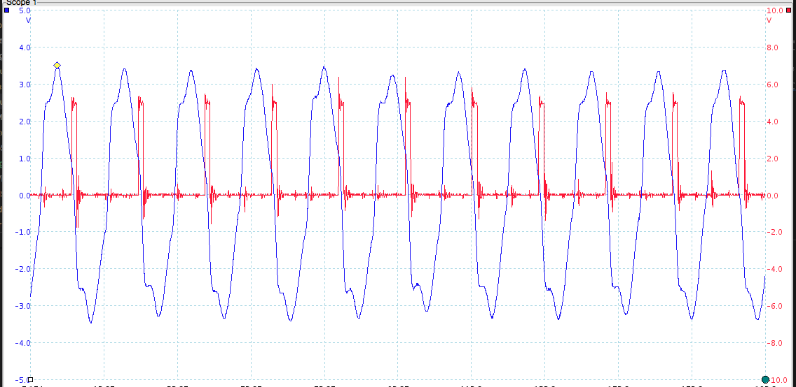
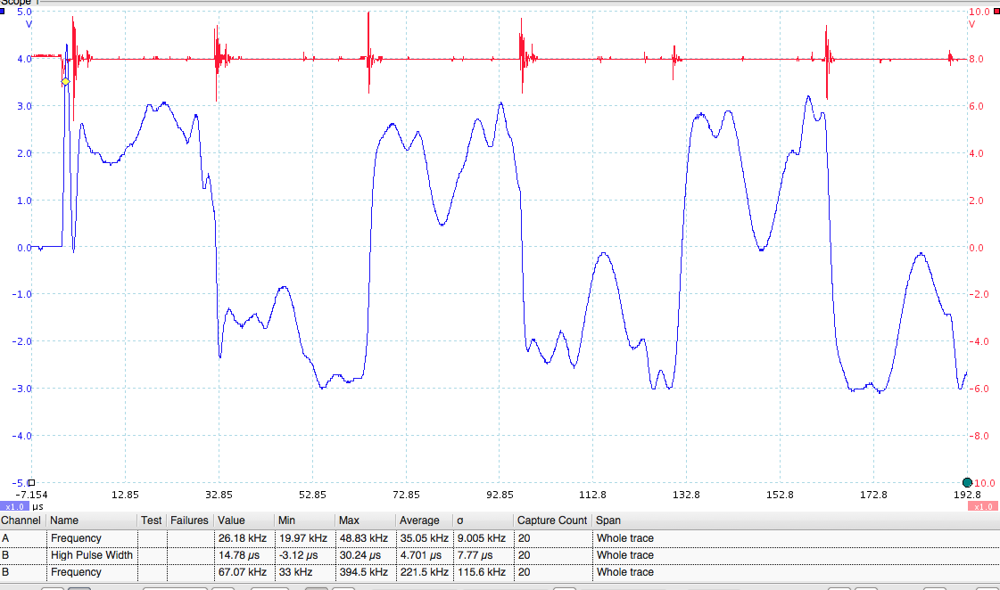
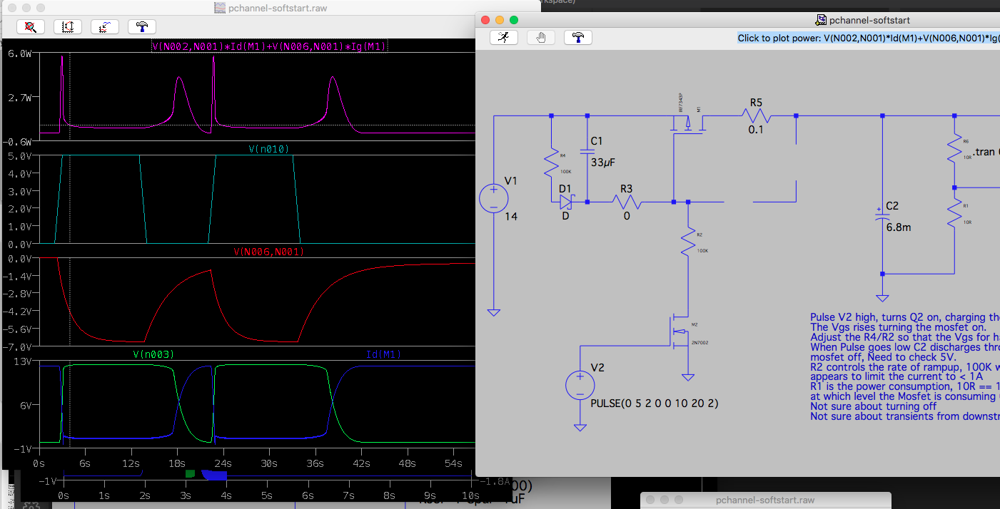
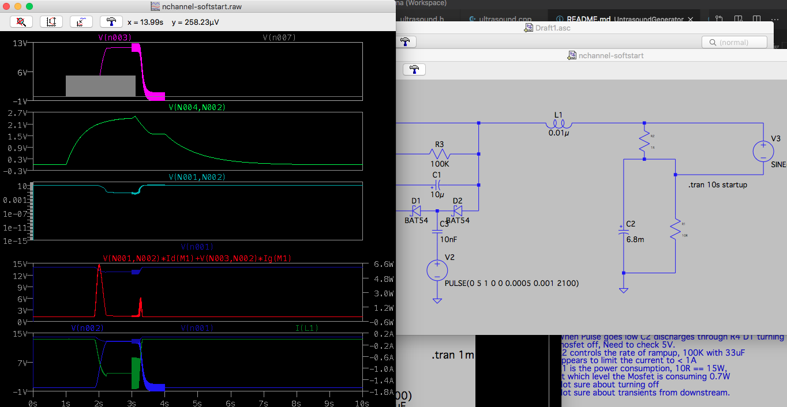
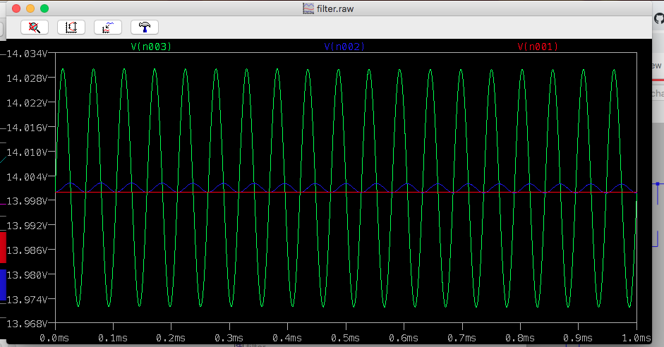

# Ultrasonic Antifouling Mk2.

My Mk1 unit finally failed after 4 years contnuous permanently on. It was only restarted when there were powercuts on shorepower. If failed because of salt getting onto the back of the board causing a short which blew the Arduino. Rather than fix, I decided to build Mk2. This time its taken 2 weeks of evenings. Last time two months.

The design is much simpler. It uses the PWM output of the Atmel328p Timer1 running off a 16MHz 5V pro mini with no pre-scaler. The MOSFET drivers are still used over driving the MOSFETs from logic levels, but there is not precise frequency generator the variable power is simplified to run in 3 states depending on input voltage. Anything over 13.7 runs at high power consumption. 13.7 to 12 at half power consumption. Below 12 the 328p goes into a sleep mode drawing 20mA until the supply voltage returns. 

This time, rather than driving 6 channels from a single Ardiono I am dedicating an Ardiono Pro Mini to each channel, and putting each in their own IP67 sealed box, with a thermally coupled external heatsink. This eliminates 600V high frequency being routed round the boat, which never felt right.

# Variable Frequency Ultrasound generator

This code generated 2 complementary square waves to drive MOSFETS to produce untrasound output. It will operate from about 200Hz to 250KHz with PWM 0-100% and deadtime control in microseconds.

It uses that standard Arduino PWM output, using the 16 bit timer 1 in mode 8 (see http://ww1.microchip.com/downloads/en/DeviceDoc/en590320.pdf) which is Phase Correct, frequency correct. The prescalar is set to 1 so the counter operates at 16MHz (Uno 5v, 16MHz). The counter counts up from 0 to the TOP value (in register ICR1) and down to zero again. 

Setup of the PWM is controlled by the registers

        TCCR1A = (TCCR1A & 0x0F) | 0xB0 ; // set pin 10 inverted  and pin 9 normal ie 0b1011xxxx
        TCCR1A = (TCCR1A & 0xFC) | 0x00 ; // phase correct pwm, mode 8, ie 0bxxxxxx00
        TCCR1B = (TCCR1B & 0xE7) | 0x10 ; // phase correct pwm, mode 8, ie 0bxxx10xxx

        TCCR1B = (TCCR1B & 0x0F8) | 0x01 ; // full speed 16MHz clock 0bxxxx001 = 16MHz 

Frequency = 16MHz/1/(2*ICR1) since the counter has to count up and down for each period of output. 

The tigger value of channel A (pin 9) is set to set digital to low at greater than a threashold value and the trigger value of channel B (pin 10) is set to set digital low below a value. As the counter ramps up channel B is turned off and after the dead time ticks have passed challen A is turned on.  Deadtime is equally spaced arround the TOP/2.  

The levels can be calculated as follows

        uint16_t deadTimeTicks = deadTimeMicros*8; // 16MHz clock, deadTimeTicks is from center so /2

        uint16_t counterTopValue = (uint16_t)(16000.0/(2*frequencyKhz));

        uint16_t center = counterTopValue/2;
        OCR1A = counterTopValue-((center-deadTimeTicks)*percent)/100;
        OCR1B = ((center-deadTimeTicks)*percent)/100;

The output needs to be fed into an inverting mosfet driver drivng a pair of mosfets driving a center tapped coil with all the normal protections. Deadtime need to be calculated based on the inductance of the coil to ensure the mostfets switch off correctly between pulses.

One anomaly that was discovered in testing, if the timer is left to run every now and again when it wraps round a super long pulse is output. This can result in not enough deadtime at which point both MOSFETS will latch up, and if there isnt a current limiting device blow them or the fuse. I used a 21w 12v bulb during testing which would light up when there was an over current event.

The fix is to zero the TCNT1 register before each pulse of output ensuring no wrap round occurs.

# Output screenshots

These are for a inverting driver, see Ultrasound.begin() for details on how to generate non invertig output.

# Driver and code

The driver is derived from the Jaycar circuit which uses a 5V PIC to drive the IRF540N mosfets directly. Instead this uses a RFP50N06 and a MCP14E4 dual 4.5A Mosfet driver capable of driving the gate(2200pf) of the Mosfet in about 15ns using guidance from Microchip design notes. Ramp on scopes confirms this. I found IRF540Ns are not robust enough to be driven with a clean 12v square wave. Output is upto 700v peak to peak. I get minimal ringing in the mosfet drive or the mosfet output with this setup and the high voltage output even looks like a clean sie wave at some frequencies.

Running the Arduino connected to a computer over serial port is not advised with the output enabled.

# Sequence

I found with the previous 6 chanel versiom that although I had an elaborate configurtion method over serial, I never used it, and connecting a usb port to this board without proper isolation potentially exposes the computer to 600V or more if something goes wrong. So I hard code the sequence and flash the pro mini to make change with the power side of the driver disabled.

In The version 2 software I had a complex output going upto 100KHz, but research indicats that while algae are discupted above 40KHz it requires very high power levels (60W or more). The researc reports that hard fouling is impacted most in the 20-30KHz range.

So this version changes the 40KHz transducers with larger 27KHz transducers and outputs between 20 and 40Khz in 100Hz steps for 600ms At full power there is a 1.4 pause between frequencies. In low power this extends to 2.4s with an extended pause every 20 steps.

Monitoring on a scope indicates the output of the 27Khz transducer is upto 30W at peak power in areas of resonance.

# LEDS

The onboard led flashes to indicate state.  Flash period is 200ms. This approach seems complex but anyone who has been at sea at night might enjoy the port hand marker impression. The reason for the flashes are to help diagnose the units behaviour without having to get a volt meter out. Couloured leds might have been easier to understand.

On boot the battery state and any fault status is reported. The fault must be fixed before the unit will power up, on boot. After boot the unit will continue to function but will report the fault on every cycle.

* Slow on off. - Normal operation state changes each time the ultrasound is switched on.
* 2 flasses power supply > 13.6v, ultrasound will operate at lower power consumption.
* 3 flasses power supply > 12.0v, ultrasound off
* 4 flashes means supply voltage is too high > 15v, the unit will not run
* 5 flashes means the initial slow charge failed to reach > 10.5v
* 6 flashes means the charge failed to sabalise at less than 2V below the supply voltage, probably a failed mosfet.
* 7 flashes means supply is turned off.
* 8 flashes means supply is on but too low to start loadswitch.
* 10 flashes means supply is turned off due to overtemp

During operation the led occults (off-on-off) as the frequency changes. At the end of each set of frequencies, voltages are checked and the unit may goin into one of 3 states.

* Standby due to a supply voltage < 12.0v, 3 flashes followed by a 60s sleep, folled by a check which may report 4 to 7 flashes.
* Low power, voltage < 13.7, 2 flashes every 5s for 30s followed by a check which may report 4 to 7 flashes.
* Full power, no flashes just a 5s sleep between operations.

# Output.

Output comes out at 757v peak to peak at masimum dropping off a bit at higher frequencies. The output wave is a lot cleaner and more sinusoidal than before, and the output sequence seems to generate more ultrasound for longer than before.

# Prototype

The prototype is on a double sided CNC milled PCB, which has been thourugly hacked to get the board quiet and efficient with minimal interference on supply line. Following units will have less hacked boards, and probably more surface mount components.

# Initial testing

Initial testing installing the driver onboard driven by a 10A switch mode power supply indicated that the surge current charging the main capacitor was well over 26A. Attempts to get the capacitor charged to start the device blew the 10A fuse and caused the power supply to shutdown due to overcurrent. So, we need a soft start mechanism. The super simple, safe, but ugly quickfix was to replace the fuse with a 21W 12V lightbulb, neatly limiting the inrush current to 2A and providing a quick over current shutdown. Its also a great indicator to show when the device is drawing more than 1A as it glows or lights up. Lifetime is probably limited. So a better solution is needed.

# Soft start and/or current limit.

Provided the device is operating correct, and the code is written to not exercise frequencies that draw excessive current for too long (eg 60KHz for the same period as 20KHz requires more energy), then a current limit is not required, only Soft start with the ability to shut down.

# Load switches

Load switches are generally P-Channel Mosfets or N-Channel. P Channel are more expensive, have higher resistence for the same die size. The aim is to turn the mosfet on slowly to reduce the current inrush, but once on keep the mostef saturated so it doesnt dissapate power and hence heat. 

# P-Channel Load switch.

This is relatively simple. Charge a capacitor between gate and source charged by the supply voltage, with a time constant that ensures the gate voltage ramps down (Vgs(th) is -ve) at a rate that ballances current against switch on time to limit the mosfet heat up. It needs a few components and an extra nmos transistor to turn the switch on. The turn on signal comes from a gio pin going high, turn off when its taken low. Model in ltspice/pchannel-softstart.asc.  Power dissapation when fully switched on is about double for a comparable P channel, and about 0.5w. This may need to he taken into account.

# N-Channel Load Switch

This is harder. The gate needs to be above the threshold voltage of the source, which when fully turned will be the same as the drain (supply voltage), so the gate needs to be at a higher voltage than the supply voltage. The solution is to use a charge pump, pumped by a square wave from the Arduino PWM output (50/50), assumning there is a spare. The copmbination of frequency of PWM, pump capacitor value and storage capacitor value controls the ultimate voltage achieved by the charge pump which tends towards the voltage of pwm output. Because the pump is decoupled from ground and coupled to the source, the voltage at the gate can rise above the absolute voltage of the suppy, and hence go fully on. Increasing the pwm frequency increases the slope, inrush current and peak power during turn on. The component count is less, and the components are less expensive, but it requires active MCU control to run.  Model in ltspice/nchannel-softstart.asc

# Filtering

Although the current driver doesnt appear to generated high frequency interference into the supply line, some sort of low pass filter should be added. LTSpice (ltspice/filter.asc) simulations indicate a 330uH coil will result in a 30mV ripple in the supply line at 1KHz, and a lot less at higher frequencies. The p-channel load switch is completely immune to the impact of a ripple, but the charge pump in the n-channel load switch is disrupted by any ripple to the extent that if it is large enough the mosfet will turn on and off and disapate more than 10W. Additionally, the mosfet remains on for as long as the ripple is present regardless of whatever the pwm is doing. Hence for the n-channel load switch a low pass filter is required to reduce the influence of any ripples generated by the driver on its operaiton. For a p-channel switch a low pass LC filter is desirable just in case any transients disrupt the mosfet or make it back to the supply line.

The v2 board generates a 4MHz ripple after that mosfets turn on that decays after 3 cycles. This is probably due to excessive paracitic capacitance in the primary coil of the transformer. Reducing the ramp rate to the gate makes little difference and attempts at altering the fequency by adding capacitance only increase heat and power consumption as a result of resonance at lower fequencies. Still looking for a solution to eliminate this resonance.

# Soft start control

The control depends on the type of switch being used. For P-Channel it can be simple digital IO pin. For the n-channel it needs to be a PWM signal at between 1KHz and 20KHz depending on the R and C values chosen in the charge pump. Standard Arduino PWM runs at 490Hz so the same techniques as with the driver will be needed. The duty cycle of the PWM can be fixed which gives a little more flexibility with which timer can be used. 

Timer1 is used for the ultrasound. Since the power enable needs to be running continuously Timer 1 cannot be re-used for this purpose. 
Timer 0 is 8bit PWM mapped to pins 5 and 6 but is used internally for millis() and delay() so the pre-scaler cannot be changed without impacting those functions.
Timer 2 is an 8bit timer on pins 11 (A) and 3(B)
Documentation page 150 in http://ww1.microchip.com/downloads/en/DeviceDoc/en590320.pdf
Fast PWM  mode goes between 0 and 0xff so only has relatively fixed frequencies
16000/(N*256), where N is 1,8,32,64,256,1024 ie 62.5,7.8,1.9,0.97,0.244,0.061 KHz
Since we need 50% PWM, standard mode may be better with the frequency changed using OCR0 register.

16000/(2*N*(1+OCRn))
N=64 gives 125 -> 0.490 KHz 
OCRn=10 = 10.4KHz
OCRn=20 = 5.9KHz
OCRn=40 = 3.8KHz
OCRn=80 = 1.5KHz
OCRn=80 = 1.5KHz
OCRn=160 = 0.7KHz
etc

# Soft start testing

Using a frequency of 5KHz for start and 40KHz for on workd, however the IRF540 Vgs at 4.5v is too low to turn the Mosfet fully on. Switching to a IRL540 (logic level), with 0.5KHz start and 20KHz on works perfectly. The inrush current is down from 26A to 0.5A and so far the IRL540 is remaining cool. 0.5Khz generates a Vgs of about 1.4v. 20KHz is about 4.5v.

# Peak current.

At resonance and frequencies above 60Khz the current rises above the current limit on the bench supply, so there will need to be some adjustment to the energy pushed into the transducer at the top end of the range so that 3x transduces dont overload a 10A switch mode supply causing it to trip.

# Heat

Looking at the v2 board with a FLIR device showed that the MCP14E4 was overheating drawing 100mA due to a fault, normally 1mA at reset. The device was broken in some way and replaced. Once fixed the unit was run for 30 after which time the board was checked again. All components were < 25C except for the core of the coil which was at 40C, it probably needs to be connected via an aluminium strip to the heatskink, and there needs to be a thermistor so the Arduino can shutdown in the event the temperature rises too high. MFR52-10K NTC will measure 4.354K at 45C see https://www.gotronic.fr/pj2-mf52type-1554.pdf. Pathching the v2 board with a simular NCT works acceptably.

# Transformer

The output of the device is about 600v peak to peak which is probably too high for the transducers and will cause premature failure. I reused transformers from the preveous generator. Unwinding the coils refealed a 4-0-4 primary and a 0-90 secondary. Since the primary is driven alternately the effective peak to peak is 28v on a 14v supply making the peak to peak output 630v which is too high and is the reason the pulse pattern needed to be so short. 

